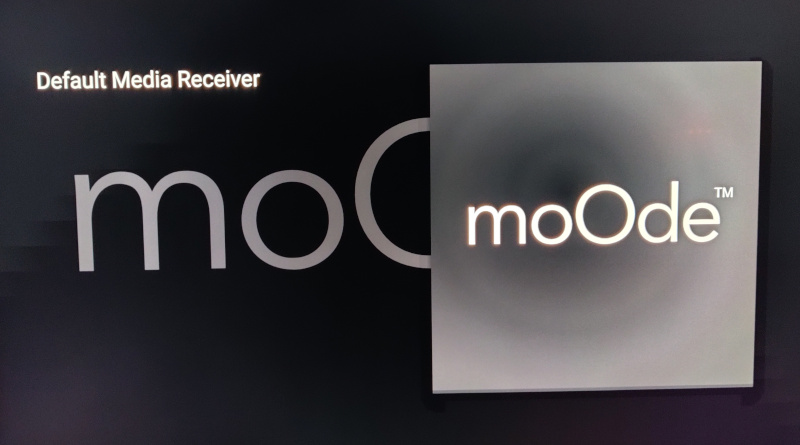
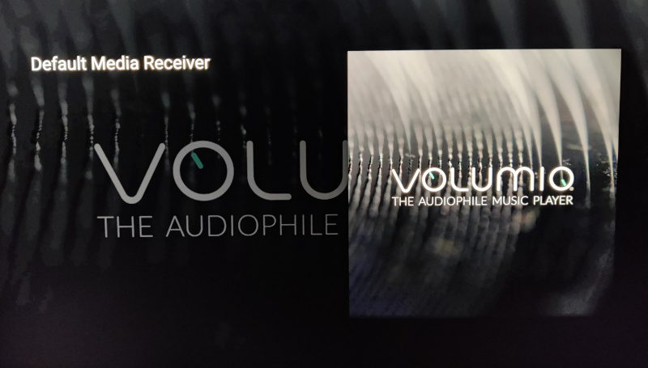

## mpd2chromecast

This is a python script and related systemd service that you can deploy on a Volumio or moOde installation and use it to integrate single and multi-room playback with Google Chromecast devices and all variants such as Google/Nest Home speakers.

The script uses an MPD client to monitor playback state of MPD, the underlying media player layer used by both Volumio and moOde. It then generates and sends a URL for the playing file to the target chromecast device or group. The chromecast then streams the file contents and plays the file. 

As you invoke play, stop, pause, next/previous, seek actions & volume control on your media platform, these are detected by the MPD interface and then relayed to the Chromecast to match the behaviour. The script also provides album artwork support that will appear on screen for video-based chromecasts.

**Note:** Does not work with the official Volumio 2.x releases but works fine on the 3.0 beta/RC releases.

**Note:** MPD Volume control needs to be enabled for this script to then relay that value to the cast device. If your MPD setup via Volumio or moOde is set to not allow MPD volume control, it may result in MPD not reporting a volume level. When this happens, the script will just disable volume support.

## Acknowledgements
The script would not be possible without the dedicated hard work of others who wrote various modules that made my job a lot easier:

* python-mp2 (https://github.com/Mic92/python-mpd2)  
This module implements an MPD client API that made everything very consistent. Prior to using this module, I was talking directly to the Volumio and moOde APIs but this approach is a lot better.

* pychromecast (https://github.com/balloob/pychromecast)  
With this module, we are able to detect and control Chromecast-based devices on the LAN.

* cherrypy (cherrypy.org)  
All URL serving provided by this script is made possible by the cherrypy module. Python does come with it's own HTTP libraries for client and server but they can be quite complex when playing a web server role. Cherrypy provides a much more mature and reliable framework for providing a directory URL server needed for the media and albumart files.

## Installation
ssh into your user account:
```
ssh volumio@volumio.local
or 
ssh pi@moode.local
```
Then start the install process as follows (you will be prompted for the password for sudo):
```
curl -s https://raw.githubusercontent.com/dresdner353/mpd2chromecast/master/install.sh | sudo bash
```
This command will:
* Install required packages..  
pip3, pychromecast cherrypy python-mpd2
* Download mpd2chromecast  
* Configure and start it as a background service (systemd)

## Web Interface


Browse to ```http://[your device ip]:8090``` and you will see a very simple web interface for managing the cast devices. The first drop-down combo shows all discovered Google cast-enabled devices. Select the desired device and it will set that as the active cast device. 

Once you have selected the desired chromecast, playback should start trying to cast the current track to the selected chromecast. From you preferred UI (Volumio or Moode Web I/F, MPD client, apps etc), try playing tracks, playlists, changing tracks, pausing, skipping and changing volume and you should see the Chromecast react pretty quickly as the script detects local MPD playback changes and casts the new tracks.

Switch chromecast device and you should experience playback stopping on the current device and transferring to the new device. By setting the device to 'Disabled', you will disable the casting functionality. 

The 2nd combo box (with play icon) can be used to toggle between two playback modes: 
* Cast file URL  
This is the default mode which serves the playing track file as a URL to the cast device. The end device will stream the selected file directly and perform all decoding. 

* Cast MPD Output Stream (experimental)  
This is experimental at present and can be enabled easily with moOde and with a bit more work on Volumio. When you select this streaming mode, it passes the fixed URL ```http://<IP>:8000``` to the selected cast device. The end result is that the stream being played is the output stream from MPD and not the original file. This allows for integration of DSP modes in MPD, crossfade and even gapless playback. It's not perfect and mileage may vary depending on how well your network works. See below on how to enable this in moOde or Volumio.

## Enabling/Disabling the Service and Troubleshooting
To see the running script. ssh into the pi and run:
```
ps -ef | grep mpd2chromecast
```

If running, you should see a running process like this:
```
pi       18160     1  5 21:41 ?        00:00:08 /usr/bin/python3 /home/pi/mpd2chromecast/mpd2chromecast.py
```

That script was run by the systemd service installed. You can stop and start this as required:
```
# stop the service
sudo systemctl stop mpd2chromecast

# start the service
sudo systemctl start mpd2chromecast

# restart the service
sudo systemctl restart mpd2chromecast

# disable the service
# This prevents the service restarting, even after a reboot
sudo systemctl stop mpd2chromecast
sudo systemctl disable mpd2chromecast

# enable the service 
sudo systemctl enable mpd2chromecast
sudo systemctl start mpd2chromecast
```

If asked to grab logs as part of troubleshooting, it's best to do something like the following:
```
sudo systemctl stop mpd2chromecast
python3 mpd2chromecast/mpd2chromecast.py

```
The above will stop the background service and let you run the script directly on the terminal and see any output it produces. You can also add the ```--verbose``` option to that command for more verbose output or even redirect the output to a file etc. Ctrl-C to stop the direct execution and run ```sudo systemctl start mpd2chromecast``` to return to the background service.


## Configuring MPD Streaming (for DSP integration or gapless playback)
If you're interested in gapless playback or leveraging any kind of DSP effects/processing provided by moOde or Volumio, then you can use the following steps to get MPD streaming enabled. Then when casting select the "Cast MPD Output Stream" to ensure that the MPD stream is cast instead of the file URL.

### moOde MPD Streaming
Navigate to Moode -> Configure -> Audio -> MPD Options -> HTTP streaming. Then enable the HTTP streaming on port 8000 with FLAC encoding (for lossless). Then click the set button to apply the change.


### Volumio MPD Streaming
With Volumio, its a bit of command line lifting:

```
ssh volumio@volumio.local
sudo nano /volumio/app/plugins/music_service/mpd/mpd.conf.tmpl
```
Then paste in the following in the audio output section:

```
audio_output {
    type "httpd"
    name "HTTP Server"
    port "8000"
    encoder "flac"
    compression "0"
    tags "yes"
    always_on "yes"
}
```

Ctrl-X and enter y to save the file.

Then you need to restart volumio to have it regenerate the MPD file:

```
volumio vrestart
```

## How it works
The script runs four threads:
* MPD/Chromecast  
This is to monitor the playback state of the server via MPD API allowing us to know what is playing and react to track changes, volume, pause/play/skip etc. It then passes these directives to the configured chromecast. It also monitors the chromecast status to ensure playback is operational. An albumart link is also passed if available.

* Cherrypy (web server)  
This thread provides a simple web server which is used to serve a file and albumart URLs for each track. It listens on port 8090 serving music URLs from /music. The chromecasts will use the URLs to stream the files for native playback. The same server is also used to provide the control interface hosted on /cast and / allowing a user to select the desired cast mode and target cast device from the list of discovered devices.

* Config  
This thread just monitors config (~/.mpd2chromecast) to track changes for the selected chromecast device or cast mode.

* Chromecast Discovery  
This thread runs continual scanning for available cast devices, adding/removing devices as they come and go from your network. 

## Audio file types that work
MPD will handle a wide range of files natively and work with attached DACs, HDMI or USB interfaces that can handle it. Bear in mind however that we are totally bypassing this layer and serving a file or stream URL directly to the selected cast device which does the decoding.

### MP3 16/320kbps & FLAC 2.0 16/44
I've had perfect results on all variants of Chromecast (Video, Audio and Home) with standard MP3 320, aac files (Apple m4a) and FLAC 2.0 16/44. I did not try ogg or raw WAV 16/44 but assume it would also work.

### FLAC 2.0 24/96
For 2-channel 24/96 high-res, the standard HD & 4K video Chromecasts will play them back but I've noticed it streams into my AVR via HDMI as 48Khz. The same 2.0 24/96 seems to stream out of the Chromecast Audio as a SPDIF digital bitstream.

### FLAC 5.1 24/96
The standard video chromecast does not work with these files at all. Playback begins to cast and then abruptly stops. On the Chromecast Audio the playback does work but with 2-channel analog output. I'm assuming it plays only two channels rather than a mix down. These files also play via Google Home devices so I'm suspecting there is a common DAC in use on both the Google Home and Chromecast audio devices. 

## Albumart & The Default Media Receiver
The standard Chromecasts, integrated TV devices and Nest Hub devices have a screen on hand. So it was obviously a goal to get albumart functional as the default media receiver can display it. The albumart cast is sourced from the cover.XXX file in the same folder as the playing track.

### Casting file URL
If using the default cast mode for file URLs, you should see the track title and cover.XXX albumart.

Example of how this albumart appears (for file casting):


The title of the current track is shown on the left. That is the only editable text field available to us. The main nuisance is the 'Default Media Receiver' text. There have been requests in the past for Google to remove this or make it editable via metadata in the cast API. To date they have not changed it. It's not easy to see in the image but a larger version of the album art is also faintly displayed in the overall background of the screen.

### Casting MPD Output Stream
If you use the "Cast MPD Output Stream" mode, static default Volumio/moOde albumart is sent to the cast devices. There is no way to cast a continuous stream and change the artwork as the tracks change without recasting each time. The script is coded to detect the Volumio/moOde variant and then tries to use the default albumart of each variant.

moOde default albumart:


Volumio default albumart:


## Extracting Albumart from your files
Not everyone will have a cover.XXX file in each album folder. I've always tried to embed artwork into my ripped flac and mp3 files. So I wrote an assistant python script (extract_albumart.py) which uses the Python mutagen module to scan a filesystem of music files, test for non-presence of cover.XXX files and then try to extract the first image from the first music file it finds in each directory. It's not a guaranteed scenario expecially if separate artwork exists per file, but its a decent shot at filling in the gaps.

To use the script, you would need to have your music resource mounted in read-write mode. This may be fine for attached USB storage but bear in mind, if trying this with a NAS mount, you would need to modify the mount settings, ensuring the "rw" option is added.

The script is invoked as follows:
```
sudo pip3 install mutagen 
python3 mpd2chromecast/extract_albumart.py --mpd_dir /var/lib/mpd/music
```
The --mpd_dir option specifies the root directory to start from. If omitted, it defaults to /var/lib/mpd/music. You can set this to any mount point on the system and could test it on a smaller sub-directory initially. 

When the script exits, it will report the total number of directories scanned, and covers it created or faied to create

## Conclusions
So I hope you find this useful if you are trying to get Volumio, moOde etc to play nice with Chromecast. 
