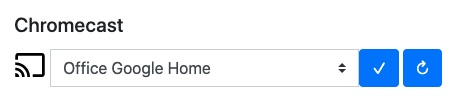
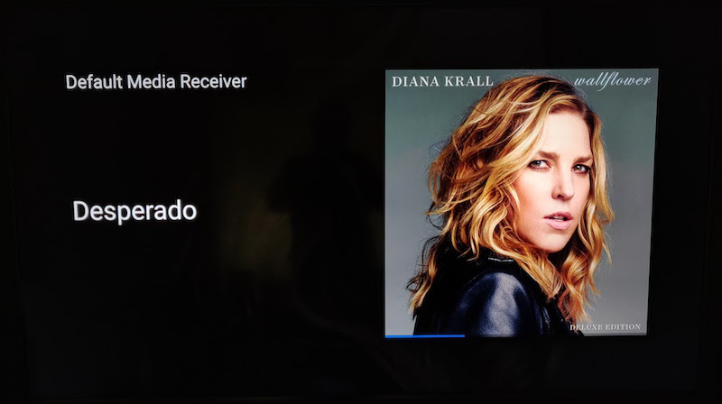

## mpd2chromecast

This is a python script and related shell wrapper that you can deploy on a Volumio or moOde installation and use it to integrate single and multi-room playback with Google Chromecast devices and all variants such as Google/Nest Home speakers.

The script uses an MPD client to monitor playback state of MPD, the underlying media player layer used by both Volumio and moOde. It then generates and sends a URL for the playing file to the target chromecast device or group. The chromecast then streams the file contents and plays the file. 

As you invoke play, stop, pause, next/previous, seek actions & volume control on your media platform, these are detected by the MPD interface and then relayed to the Chromecast to match the behaviour. The script also provides album artwork support that will appear on screen for video-based chromecasts.

## Acknowledgements
The script would not be possible without the dedicated hard work of others who wrote various modules that made my job a lot easier:

* python-mp2 (https://github.com/Mic92/python-mpd2)  
This module implements an MPD client API that made everything very consistent. Prior to using this module, I was talking directly to the Volumio and moOde APIs but this approach is a lot better.

* pychromecast (https://github.com/balloob/pychromecast)  
With this module, we are able to detect and control Chromecast-based devices on the LAN.

* cherrypy (cherrypy.org)  
All URL serving provided by this script is made possible by the cherrypy module. Python does come with it's own HTTP libraries for client and server but they can be quite complex when playing a web server role. Cherrypy provides a much more mature and reliable framework for providing a directory URL server needed for the media and albumart files.


## Installation
For installation on Volumio, [see Volumio README](./volumio.md)  
For installation on moOde, [see moOde README](./moOde.md)  

## Selecting Desired Chromecast
After everything is installed and ready to ry out, the first step is to select the desired chromecast or cast-enabled device on your network.

You should first run the set_chromecast.py script to perform a scan and then select the desired device/group. 

For example:
```
$ ./mpd2chromecast/set_chromecast.py 
Discovering Chromecasts.. (this may take a while)
Found 11 devices
 0   off
 1   Living Room
 2   Downstairs
 3   Kitchen
 4   Master Bedroom Wifi
 5   Living Room Google Home
 6   Entire House
 7   All Google Homes
 8   Office Google Home
 9   Office Test
10   Hall Google Home
11   Kitchen Google Home
Enter device number: 9
Setting desired Chromecast to [Office Test]
```
This then saves the selected chromecast name in ~/.castrc. 

You can also invoke that script with the --name option to directly set the desired Chromecast without having to scan:
```
$ ./mpd2chromecast/set_chromecast.py --name 'Office'
Setting desired Chromecast to [Office]
```

## Test Run
To get the script running on a terminal, just do the following:
```
LC_ALL=en_US.UTF-8 ~/mpd2chromecast/mpd2chromecast.py 
```
In this mode, the script will output data every second showing playback status for your media player and any related activity from the Chromecast. Once you have the script running, it should start trying to cast the current playlist to the selected chromecast. Try changing tracks, pausing, skipping and changing volume and you should see the Chromecast react pretty quickly.

Note: The use of LC_ALL set to US UTF-8 was something I was forced to do because when left on my default locale (Ireland UTF-8), something went wrong with how UTF-8 characters we being matched between filenames on the disk and the URLs. I suspect it relates to locale specifics not present within the Raspian image. Forcing US UTF-8 sorts this however.

## Starting the Agent in the Background

To start the agent in the background, use this command:
```
./mpd2chromecast/mpd2chromecast.sh
```
You can also force a restart of the agent using the "restart" option:
```
./mpd2chromecast/mpd2chromecast.sh restart
```

## Enabling the script to run at startup
The shell script mentioned above is crontab friendly in that it can be invoked continually and will only start the agent if it's not found to be running. 

To setup crontab on the Pi:
```
sudo apt-get install cron
sudo update-rc.d cron enable 2 3 4 5
sudo /etc/init.d/cron start
   
crontab -e 
    when prompted, select the desired editor and add the appropriate
    line from below...

    # for Volumio, home is /home/volumio 
    * * * * * /home/volumio/mpd2chromecast/mpd2chromecast.sh > /dev/null

    # for moOde, home is in /home/pi
    * * * * * /home/pi/mpd2chromecast/mpd2chromecast.sh > /dev/null

```

## Dynamically switching Chromecast
When using the saved config approach, the script watches the ~/.castrc file for changes. If it detects a change, it reloads config, re-resolves the Chromecast and switches device. It will also try to stop playback on the current device.

All you need to do is run the set_chromecast.py script and specify the new device or select from its menu. Once saved, the playback should switch devices in about 10-20 seconds, giving time for the change to be detected and discovery of the new device to take place.

## Disabling
To stop casting, you can normally either pause playback or clear the playlist. You could also disable the casting permanently by deleting/commenting out the crontab entry. 

However there is an easier way to do this by setting the configured chromecast device to 'off'. 
```
$ ./mpd2chromecast/set_chromecast.py --name 'off'
Setting desired Chromecast to [off]
```
This will cause the script to disconnect from any existing cast device and disable any further attempts to connect to a chromecast until the configured device name is again changed.

## Web Interface (experimental)

Browse to your http://[your device ip]:8080/cast and you will see a very simple web interface with a drop-down combo of all discovered chromecast devices. Select the desired device and click the tick-box button and it will set that as the active cast device. You can also refresh the list using the reload button.

## How it works
The script runs four threads:
* MPD/Chromecast  
This is to monitor the playback state of the server via MPD API allowing us to know what is playing and react to track changes, volume, pause/play/skip etc. It then passes these directives to the configured chromecast. It also monitors the chromecast status to ensure playback is operational. An albumart link is also passed if available.

* Cherrypy (web server)  
This thread provides a simple web server which is used to serve a file and albumart URLs for each track. It listens on port 8080 serving music URLs from /music. The chromecasts will use the URLs to stream the files for native playback. The same server is also used to provide a simple control interface hosted on /cast allowing a user to select a desired cast device.

* Config  
This thread just monitors config (~/.castrc) and changes one internal global variable for the selected chromecast device.

* Chromecast Discovery  
This thread runs on loop every minute, scanning for available chromecasts and stores the names (in /tmp/castdevices). The intention here is to get platform plugins to leverage that detail for something like a GUI selection of the desired chromecast. The same file is also used for a faster execution of set_chromecast.py (when the --discover option is omitted) instead of having to wait for a scan each time.

## Audio file types that work
MPD will handle a wide range of files natively and work with attached DACs, HDMI or USB interfaces that can handle it. Bear in mind however that we are totally bypassing this layer and serving a file URL directly to the Chromecast and all decoding is done by the Chromecast.

### MP3 16/320kbps & FLAC 2.0 16/44
I've had perfect results on all variants of Chromecast (Video, Audio and Home) with standard MP3 320, aac files (Apple m4a) and FLAC 2.0 16/44. I did not try ogg or raw WAV 16/44 but assume it would also work.

### FLAC 2.0 24/96
For 2-channel 24/96 high-res, the standard HD & 4K video Chromecasts will play them back but I've noticed it streams into my AVR via HDMI as 48Khz. The same 2.0 24/96 seems to stream out of the Chromecast Audio as a SPDIF digital bitstream.

### FLAC 5.1 24/96
The standard video chromecast does not work with these files at all. Playback begins to cast and then abruptly stops. On the Chromecast Audio the playback does work but with 2-channel analog output. I'm assuming it plays only two channels rather than a mix down. These files also play via Google Home devices so I'm suspecting there is a common DAC in use on both the Google Home and Chromecast audio devices. 

## Albumart & The Default Media Receiver
The standard Chromecasts, integrated TV devices and Nest Hub devices have a screen on hand. So it was obviously a goal to get albumart functional as the default media receiver can display it.

Example of how this albumart appears:

The title of the current track is shown on the left. That is the only editable text field available to us. The main nuisance is the 'Default Media Receiver' text. There have been requests in the past for Google to remove this or make it editable via metadata in the cast API. To date they have not changed it. It's not easy to see in the image but a larger version of the album art is also faintly displayed in the overall background of the screen.

Getting albumart proved a bit cumbersome. MPD support via python-mpd2 is not yet working (although it seems to be present in the code). Both Volumio and moOde have their own ways of extracting album art separate from MPD but neither make it seamless to grab this data via native APIs. The main issue was timing where the native API is not always in sync with the MPD playlist. It became a hit and miss in getting accurate albumart with the wrong image often being served up. 

So in the end, to keep things more universal, I copied what MPD server-side itself does... when a track is being cast, the script checks the parent directory of the said file and checks for cover.(png|jpg|tiff|bmp|gif). If that file is found, it generates a URL for this file and serves it to the Chromecast along with the audio file URL. 

## Extracting Albumart from your files
Not everyone will have a cover.XXX file in each album folder. I've always tried to embed artwork into my ripepd flac and mp3 files. So I wrote an assistant python script (extract_albumart.py) which uses the Python mutagen module to scan a filesystem of music files, test for non-presence of cover.XXX files and then try to extract the first image from the first music file it finds in each directory. It's not a guaranteed scenario expecially if separate artwork exists per file, but its a decent shot at filling in the gaps.

To use the script, you would need to have your music resource mounted in read-write mode. This may be fine for attached USB storage but bear in mind, if trying this with a NAS mount, you would need to modify the mount settings, ensuring the "rw" option is added.

The script is invoked as follows:
```
sudo pip3 install mutagen 
python3 mpd2chromecast/extract_albumart.py --mpd_dir /var/lib/mpd/music
```
The --mpd_dir option specifies the root directory to start from. If omitted, it defaults to /var/lib/mpd/music. You can set this to any mount point on the system and could test it on a smaller sub-directory initially. 

When the script exits, it will report the total number of directories scanned, and covers it created or faied to create

## Conclusions
So I hope you find this useful if you are trying to get Volumio, moOde etc to play nice with Chromecast. 
